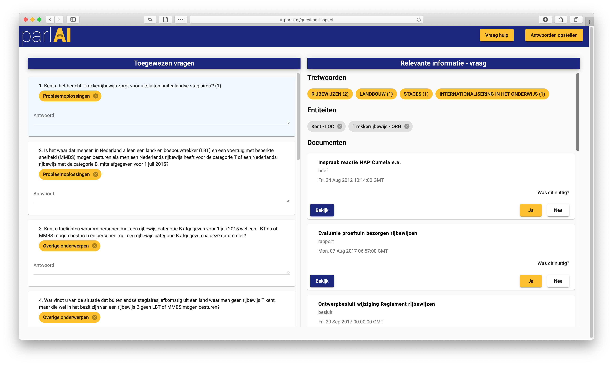

# ParlAI

ParlAI is a fully featured question answering management system that combines the use of NLP techniques like topic modelling, entity recognition and information retrieval to assist the Ministry of Infrastructure & Waterways into being proactive when answering parliamentary questions. 

## ParlAI' Technology stack:
- Database: MySQL hosted on AWS RDS.
- Backend: Flask JSON API hosted on Heroku.
- Frontend: Angular 7 app hosted on github pages.

It is publicly available for anyone to test at https://parlai.nl

## ParlAI's main features involve:
- Question Extraction: Individual Questions are automatically extracted from the documents and saved to the database.
- Topic Modelling: Questions are grouped into 10 different topics including Environment, Transport, Waterways.
- Entity Extraction: From each document we extract named entities, keywords & urls.
- Document Retrieval: Relevant documents are retrieved per question, providing information for answering it.
- Call an Expert: View list of colleagues who are experts on the topics you currently work on.
- Integrated Peer Feedback: Review the peer feedback you receive for your answers.

## ParlAI's Question Inspect Screen

